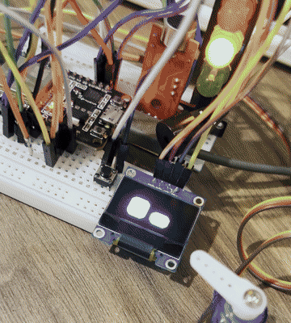

# Cozmo ESP32

[](https://www.instagram.com/mrfab.dev)
[](https://mrfab.dev/)
[](LICENSE)



*Rodando na bancada. [Vídeo em melhor qualidade](assets/demo.mp4).*

Um robozinho de bancada com rosto animado num OLED, que conversa por voz em português,
controla o Mac e joga pedra-papel-tesoura.

Feito com um ESP32 de R$ 40 e peças de marketplace. O ESP32 cuida do corpo (rosto, luzes,
som, braço, sensores) e o navegador do celular ou do Mac cuida da conversa, falando direto
com a API de voz. Assim o ESP32 nunca precisa processar áudio.

## O que ele faz

- **Rosto animado**: olhos que piscam, olham em volta, mudam de humor e "respiram" no ritmo da fala.
- **Conversa por voz em pt-BR**: você fala, ele responde falando, com interrupção de turno automática.
- **Dados reais, sem inventar**: hora, temperatura e cotação de criptomoedas vêm de fontes de verdade,
  entregues ao modelo como contexto. Ele não chuta números.
- **Expressões e luzes por voz**: "fica feliz", "acende a luz vermelha", "pisca a amarela".
- **Braço servo**: acena, gira, dança.
- **Pedra, papel e tesoura**: contagem no semáforo, jogada sorteada pelo hardware, placar calculado
  no ESP32 (o modelo não decide quem ganhou).
- **Controle do Mac**: abre apps e sites, pesquisa no Google e no YouTube.
- **Cria páginas web por voz**: escreve o HTML, abre no VS Code e no Chrome, e edita ao vivo
  ("troca o fundo pra azul") com o navegador recarregando sozinho.
- **WhatsApp por voz**: escreve a mensagem no chat aberto e só envia depois de você confirmar falando.

## Como funciona

```
  você fala
     │
     ▼
navegador (celular ou Mac) ──WebSocket──> Deepgram Voice Agent
     │                                    (transcreve, pensa com gpt-4o-mini, responde em voz)
     │  HTTP                                        │
     ▼                                              │ chamadas de função
  ESP32 (rosto, luzes, som, braço, sensores) <──────┤
     │                                              │
     ▼                                              ▼
  OLED / LEDs / servo / sensores              ponte Python no Mac
                                             (abre apps, escreve páginas, WhatsApp)
```

O ESP32 sobe um servidor web na rede local. A página que ele serve é a interface: botões de humor,
caixa de texto e o botão de conversa. Toda a parte de áudio acontece no navegador.

## Hardware

Exatamente o que foi usado na montagem.

### Usados no projeto

| Peça | Para quê | Link |
|---|---|---|
| ESP32 WROOM-32 (DevKit 30 pinos) | o cérebro | [comprar](https://s.shopee.com.br/7fZxJRW2Wt) |
| Display OLED I2C 0,96" azul/amarelo | o rosto | [comprar](https://s.shopee.com.br/6q0qJxpbBB) |
| Módulo semáforo LED | luzes de humor e contagem do jogo | [comprar](https://s.shopee.com.br/30o7kx7meP) |
| Buzzer ativo 5V | bipes e efeitos | [comprar](https://s.shopee.com.br/60RjKUi9Nf) |
| Micro servo SG90 (versão 360°, rotação contínua) | o braço | [comprar](https://s.shopee.com.br/9fL1hGGOFh) |
| Sensor de som KY-037 | ele se assusta com barulho | [comprar](https://s.shopee.com.br/8AWDuWm1ib) |
| Chave táctil 6x6x5mm | o "carinho" | [comprar](https://s.shopee.com.br/6Al9WsJdR8) |
| Protoboard 400 pontos | montagem | [comprar](https://s.shopee.com.br/7ptNVxqLVa) |
| Jumpers macho/macho e macho/fêmea | ligações | [comprar](https://s.shopee.com.br/8AWDubFCyx) |
| Resistores 220Ω | LEDs e divisor de tensão | [comprar](https://s.shopee.com.br/3LQy9k6GUu) |

### Use também com essas opções

| Peça | Para quê | Link |
|---|---|---|
| Microfone I2S INMP441 | fazer ele ouvir sozinho, sem depender do celular | [comprar](https://s.shopee.com.br/W6mmbt266) |
| Mini alto-falante 3W 4Ω | a voz sair do robô, não do celular | [comprar](https://s.shopee.com.br/2gBHMcO7EB) |
| Amplificador PAM8403 | ligar o alto-falante (o pino do ESP32 não dá conta) | [comprar](https://s.shopee.com.br/7VGX7XiMq0) |

## Ligação

| Pino | Ligado em |
|---|---|
| D21 / D22 | OLED: SDA / SCL (3V3 e GND) |
| D26 / D33 / D32 | LEDs verde / amarelo / vermelho do semáforo |
| D25 | buzzer (perna + no pino, − no GND) |
| D27 | chave táctil (outro lado no GND) |
| D15 | KY-037, saída **DO** (VCC no 3V3) |
| D14 | servo, fio de sinal (VCC no VIN, GND comum) |

O servo puxa corrente demais para o pino 5V do ESP32 quando tem carga. Se a placa reiniciar sozinha
ao mexer o braço, é isso: use fonte separada com GND comum, ou um capacitor de 470µF entre 5V e GND.

## Como rodar

**1. Bibliotecas na Arduino IDE**

`Adafruit SSD1306`, `Adafruit GFX`, `ArduinoJson` (v7) e `ESP32Servo`.

**2. Suas chaves**

```bash
cp secrets.example.h secrets.h
```

Preencha com a sua rede WiFi (2.4GHz; o ESP32 não enxerga 5GHz), sua chave da OpenAI, sua chave do
Deepgram e as coordenadas da sua cidade. O `secrets.h` está no `.gitignore`.

**3. Suba o sketch**

O OLED mostra o IP por 3 segundos ao ligar. Abra esse IP no navegador.

**4. Libere o microfone no Chrome**

O navegador bloqueia o microfone em páginas `http://`. Em `chrome://flags`, procure
**Insecure origins treated as secure**, **digite o endereço do Cozmo na caixa de texto**
(ex.: `http://192.168.15.201`), deixe em *Enabled* e reinicie o navegador. Só ligar o flag sem
preencher a caixa não funciona.

**5. Ponte do Mac (opcional)**

Só precisa se quiser que ele controle o computador. Não instala nada, é biblioteca padrão:

```bash
python3 mac/cozmo_mac.py
```

Ajuste a constante `COZMO_ORIGIN` no arquivo com o IP do seu Cozmo. Para o WhatsApp funcionar, libere
o Terminal em **Ajustes do Sistema → Privacidade e Segurança → Acessibilidade**. A conversa precisa
estar aberta no Chrome **do Mac**, não no celular.

## Comandos de voz

```
"que horas são?"                      "fica feliz" / "faz cara de bravo"
"quanto está o bitcoin?"              "acende a luz vermelha" / "pisca a amarela"
"qual a temperatura?"                 "dá tchau" / "dança"
"vamos jogar pedra, papel e tesoura"  "abre o WhatsApp" / "abre minha agenda"
"pesquisa X no YouTube"
"cria uma página escrito ..."         "troca o fundo pra azul" / "abre no Chrome"
"manda no WhatsApp: chego em 10"      → ele lê o rascunho e espera você confirmar
```

## Segurança

- As chaves ficam no `secrets.h`, fora do git. Use chaves separadas para o robô, com limite de gasto.
- A ponte do Mac escuta só em `127.0.0.1` e só aceita pedidos vindos da página do Cozmo. Ela executa
  apenas ações de uma lista fixa: nunca comando livre, mesmo que o modelo entenda errado.
- O WhatsApp tem duas travas além do prompt: o envio só passa se você tiver falado **depois** do
  rascunho, e se a sua fala parecer uma confirmação. Um "não" ou "cancela" bloqueia.
- As páginas geradas vão sempre para o mesmo arquivo, dentro da pasta do projeto.

## Estado atual e limitações

- **Não dá para interromper a fala dele.** Enquanto ele fala, o microfone para de enviar, senão ele se
  ouve pelo alto-falante e responde a si mesmo. Com fone de ouvido daria para liberar.
- **A voz sai do celular ou do Mac**, não do robô: é o navegador que ouve e fala.
- **A síntese de voz é a da OpenAI**, porque o TTS do Deepgram ainda não fala português.
- **O servo é de rotação contínua**, então ele não sabe onde o braço está: os movimentos são por tempo.
- **Existe código não testado no sketch**: um modo que mede o nível de água num copo com o HC-SR04
  (pinos D18 e D19, com divisor de tensão no ECHO). O sensor comprado não respondeu — a ligação foi
  validada, o ESP32 dispara e lê o pulso, mas ele não escuta o eco de volta. Como nunca funcionou de
  ponta a ponta, não conto isso como recurso do projeto.

## Estrutura

```
cozmo.ino              sketch principal: rosto, voz, jogos, sensores, servidor web
secrets.example.h      modelo de configuração (copie para secrets.h)
mac/cozmo_mac.py       ponte que deixa ele controlar o Mac
mac/test_cozmo_mac.py  testes da ponte (não tocam no WhatsApp de verdade)
testes/                sketches de diagnóstico, um por peça
```

Os sketches em `testes/` são o que mais economizou tempo no projeto: quando algo não funcionava,
testar a peça sozinha separava problema de ligação de problema de código em poucos minutos.

## Autor

**Fabrício Dev** — [mrfab.dev](https://mrfab.dev/) · [@mrfab.dev no Instagram](https://www.instagram.com/mrfab.dev) · [@fabriciowth no GitHub](https://github.com/fabriciowth)

Este robô nasceu de uma caixa de componentes e muita tentativa e erro. Os bastidores e os vídeos
dele funcionando saem primeiro no Instagram. Se o projeto te ajudou, seguir por lá e deixar uma
estrela aqui ajuda bastante.

## Licença

[MIT](LICENSE) — use, modifique e distribua à vontade, inclusive comercialmente. A única condição é
**manter o aviso de copyright**: se publicar algo derivado deste projeto, credite
Fabrício Dev (@mrfab.dev).
